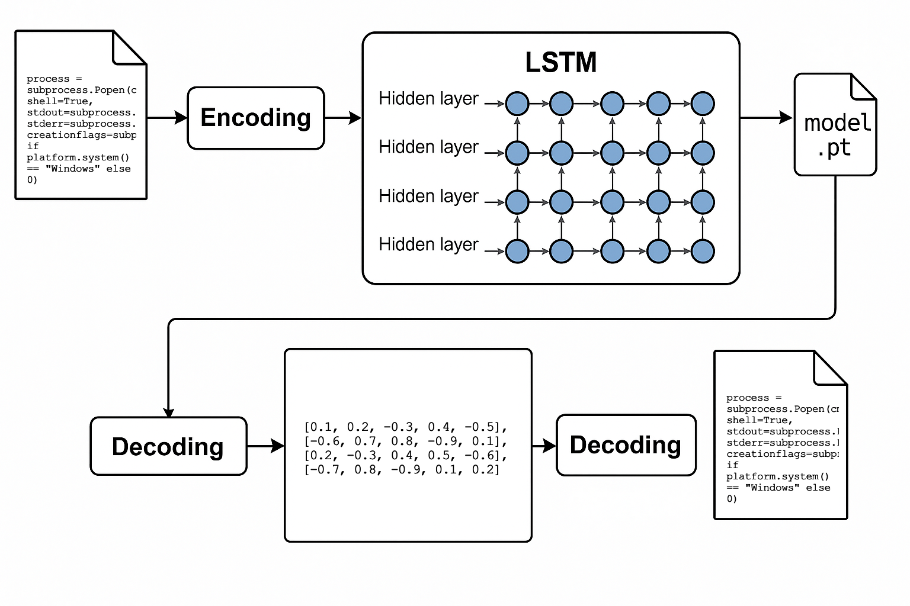
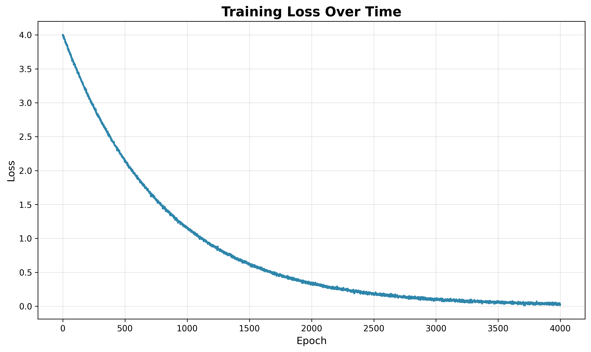
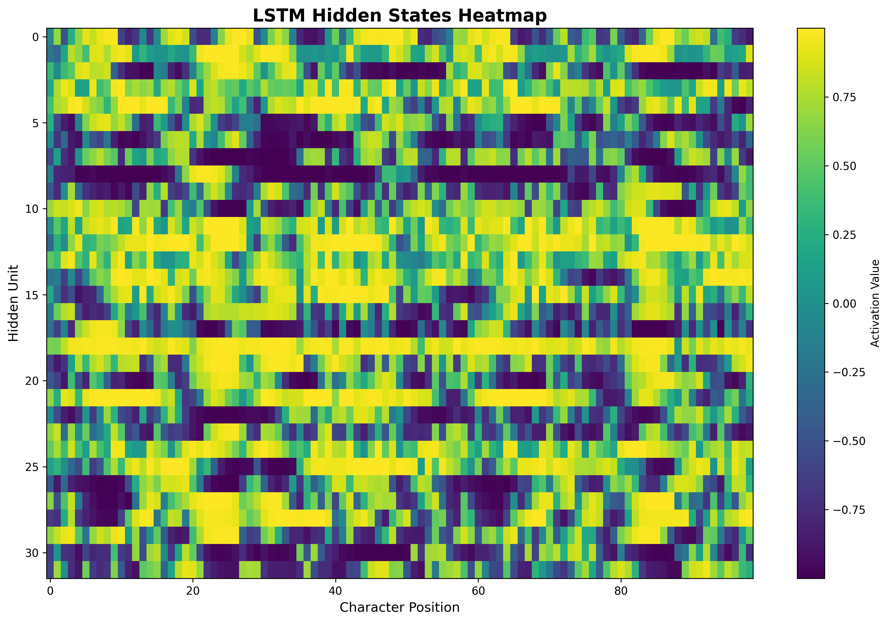
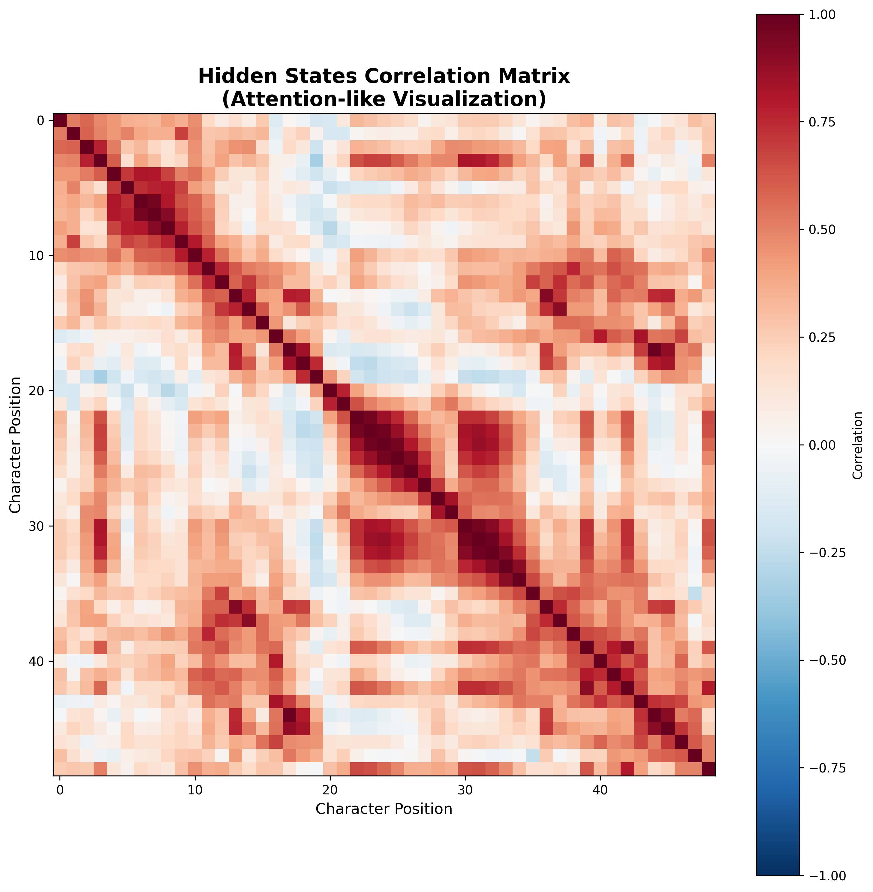

# Char-level LSTM Memorizer PoC



**Original article:** [LSTM or Transformer as "malware packer"](https://bednarskiwsieci.pl/en/blog/lstm-or-transformer-as-malware-packer/)

A simple proof-of-concept demonstrating how to **embed any text file** (e.g., source code) into the weights of a character-level LSTM neural network model and then **accurately reconstruct** its contents during inference.

## Features

- Builds a character-level vocabulary + a special Beginning-of-Sequence (BOS) token.
- Trains an LSTM on a single file until overfitting (memorization).
- Generates the entire character sequence starting from the BOS token.
- Compares SHA-256 checksums of the original and generated files.

## Requirements

- Python 3.12+
- PyTorch 2.7.1+
- NumPy 2.3.1+
- Safetensors 0.5.3+
- Matplotlib 3.10.3+
- Ruff 0.12.2+ (optional)

Use `uv` to manage dependencies. If you don't have `uv` installed, you can install it via pip:

```bash
pip install uv
```

## Installation

1. Clone the repository:

   ```bash
   git clone https://github.com/piotrmaciejbednarski/lstm-memorizer.git
   cd lstm-memorizer
   ```

2. Synchronize using `uv`:

   ```bash
   uv sync
   ```

## Example

One of the generated examples can be found in the `example` directory. The model weights `model.safetensors` were trained on `bubble_sort.py`.

You can run the entire process in encoding mode and then decoding mode to verify that the generated file is identical to the original.

### Training

```bash
uv run main.py train ./examples/bubble_sort.py \
    --epochs 4000 \
    --hidden 32 \
    --layers 2 \
    --lr 1e-3 \
    --weights ./output/model.safetensors
```

```
Using device: mps
Epoch 1/4000 loss=4.0081
Epoch 500/4000 loss=0.5532
Epoch 1000/4000 loss=0.1054
Epoch 1500/4000 loss=0.0395
Epoch 2000/4000 loss=0.0220
Epoch 2500/4000 loss=0.0120
Epoch 3000/4000 loss=0.0076
Epoch 3500/4000 loss=0.0051
Epoch 4000/4000 loss=0.0060
Model saved to ./output/model.safetensors
```

### Generating

```bash
uv run main.py generate ./examples/bubble_sort.py \
    --weights ./output/model.safetensors \
    --output ./output/generated.py \
    --hidden 32 \
    --layers 2
```

```
Generated and saved to ./output/generated.py
Input SHA256:  95a82277b56978eeb1de2dd3d3c0e46f1b7ebd96bfe6a4dbedcd18bb40be1b25
Output SHA256: 95a82277b56978eeb1de2dd3d3c0e46f1b7ebd96bfe6a4dbedcd18bb40be1b25
Hashes match.
```

### Visualization

Generate demonstration charts to analyze model behavior:

```bash
uv run main.py visualize ./examples/bubble_sort.py \
    --weights ./output/model.safetensors \
    --hidden 32 \
    --layers 2 \
    --output-dir charts
```

```
Training loss plot saved to charts/training_loss.png
Hidden states heatmap saved to charts/hidden_states_heatmap.png
Attention-like heatmap saved to charts/attention_heatmap.png
All demo charts generated in charts/
```

## Results & Analysis

### Training Loss


The training loss plot shows exponential decay from ~4.0 to ~0.006 over 4000 epochs, demonstrating successful memorization of the input file. The smooth convergence indicates stable learning without overfitting oscillations.

### Hidden States Heatmap


**What it visualizes:**
- **X-axis**: Character position in sequence
- **Y-axis**: Hidden unit number in LSTM layer
- **Color**: Activation strength of each hidden unit

**Key insights:**
- **Vertical patterns**: Different hidden units specialize in different types of characters or code structures
- **Horizontal patterns**: Sequential dependencies and context propagation through the LSTM
- **Bright regions**: Areas where the model focuses computational resources
- **Dark regions**: Less active units or characters that require minimal processing

This heatmap reveals how the LSTM distributes information across its hidden state, showing which neural units are responsible for encoding different parts of the code structure.

### Attention-like Correlation Matrix


**What it visualizes:**
- **Both axes**: Character positions in the sequence
- **Color**: Correlation between hidden states at different positions (-1 to +1)
- **Red**: Strong positive correlation
- **Blue**: Strong negative correlation
- **White**: No correlation

**Key patterns observed:**
- **Diagonal band**: Strong local correlations between adjacent characters
- **Block structures**: Code segments (functions, loops) form coherent representational units
- **Long-range correlations**: Red dots far from diagonal indicate the model discovered relationships between distant code elements (e.g., opening/closing brackets, variable definitions and usage)
- **Negative correlations**: Blue regions show where different code structures are encoded with opposing patterns

**Structural insights:**
- **Positions 0-10**: Function header `def bubble_sort(arr):`
- **Positions 20-30**: Outer loop structure with strong internal correlations
- **Positions 35-45**: Inner loop with conditional statements
- **Cross-correlations**: The model learned to associate related code elements like matching brackets, variable scopes, and control flow structures

This visualization demonstrates that the LSTM doesn't just memorize character sequences but learns **hierarchical code representations** and **structural relationships** within the program.

## Extensions and Ideas

You can use any RNN or Transformer architecture for this task, as the concept of "overfitting the neural network" applies universally. I chose LSTM for its simplicity and suitability for this example, as we do not require the attention mechanism present in Transformers. The task at hand is deterministic, where the decoder's sequence should always be the same, making LSTM a fitting choice.

- Experiment with different network depths and widths.
- Use mixed precision training.
- Checkpointing and resuming training.
- Scheduler for learning rate.
- Early stopping.

## License

This project is released under the MIT License. See [LICENSE](LICENSE) for details.

**If you use this code in your research or projects, please cite the original article:**

```bibtex
@misc{bednarski2025lstm,
  author = {Bednarski, Piotr Maciej},
  title = {LSTM or Transformer as “malware packer”},
  year={2025}, month={Jun},
  url = {https://bednarskiwsieci.pl/en/blog/lstm-or-transformer-as-malware-packer/}
}
```
